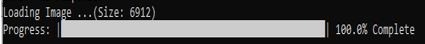
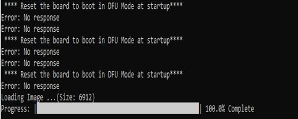

# DFU Functionality - Serial image bootloader

DFU, the device firmware upgrade in bootloader is used to load new image which is received from host over serial interface and writes into the flash\(Slot 1\). The host may be python script or pc tool.

There are two possible ways the device bootloader can be put into DFU mode

-   **GPIO trigger DFU Mode**

    By holding GPIO pin/button and resetting the board helps to enter DFU mode

-   **Timer based trigger DFU Mode**

    Upon boot, bootloader enters into DFU mode and will be in DFU mode for the defined time for example: 400ms, then upon timeout, control jumps to application. So the host application/script should be sending messages to load the new image very frequently so that when reset is triggered, it loads the new image since the bootloader will be in DFU mode

**Using Python Scripts for serial bootloading\(DFU\) of image**

The following steps provides information on how to load a new image into slot 1 by serial bootloading using python scripts

**GPIO trigger DFU Mode**

1.  After downloading the bootloader\(GPIO trigger DFU\) image\(Refer Step 4 [Create and generate bootloader standalone project for bootloader image](GUID-4552A2E4-E35C-4FD0-9C01-0EE86D4F6163.md) for GPIO trigger DFU Configuration \), put the bootloader into DFU Mode by holding GPIO button and press reset button on the Curiosity board. Verify the console that ‘DFU Now!’ is shown for confirmation of DFU mode if Enable Console option is enabled
2.  Copy **flash\_load\_2ndSlot.py** and **progctrl.py** python files \(from wireless\_pic32cxbz\_wbz\\utilities\\pic32cx-bz\\dfuPythonScripts\) into a folder where image is available\(For example: image.bin\).
3.  Open command prompt in the same folder and run the below command

    **python flash\_load\_2ndSlot.py -i image.bin**

4.  The image will get loaded into the slot by showing output like this 

**Timer based trigger DFU Mode**

1.  After downloading the bootloader\(Timer Based Trigger DFU\) image\(Refer Step 5 [Create and generate bootloader standalone project for bootloader image](GUID-4552A2E4-E35C-4FD0-9C01-0EE86D4F6163.md) for Timer Based Trigger DFU Configuration\), you will be able to see the bootloader enters DFU Mode, then exits after the defined time \(400ms default\) and jumps to the application image if valid application image available
2.  Copy **flash\_load\_2ndSlot\_timer.py** and **progctrlOptimized.py** python files\(from wireless\_pic32cxbz\_wbz\\utilities\\pic32cx-bz\\dfuPythonScripts\) into a folder where image is available\(For example: image.bin\).
3.  Open command prompt in the same folder and run the below command

    python flash\_load\_2ndSlot\_timer.py -i image.bin

4.  Now reset the board so that bootloader enters into DFU mode as per Timer Based Trigger DFU mode
5.  The image will get loaded into the slot by showing output like this 

**Parent topic:**[PIC32CX-BZ2 Standalone Bootloader Component Help](GUID-A04B5B1F-202B-4944-B18F-13E4857CC3CD.md)

