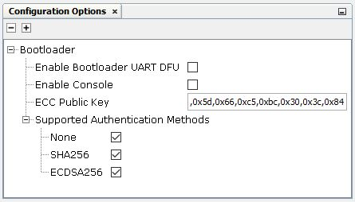
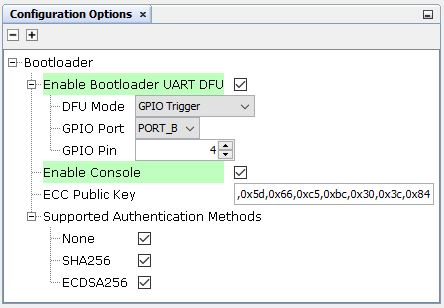
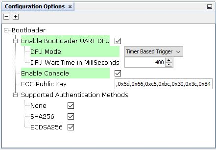

# Configuration Options

Default configuration options window for bootloader is shown below

**Enable Console option**

By enabling this option, Information on bootloader activities will printed into console using SERCOM UART. By Default, this option is disabled. When this option is enabled, make sure to connect the UART dependency in the bootloader with the SERCOM UART.

**ECC Public Key**

By default, ECC Public key is 0xc2,0x81,0x8f,0xbb,0x28,0x61,0x47,0x8b,0xa2,0x53,0x37,0x79,0xd4,0x63,0x18,0x7c,0x8b,0x41,0x59,0xa9,0x5f,0x0b,0x6b,0x94,0x4e,0xb9,0x57,0xa1,0x03,0xfe,0x20,0xbf,0x2b,0xb8,0x14,0x2a,0x64,0xb5,0xae,0x4a,0x83,0x80,0xdd,0xe6,0xee,0x29,0x89,0xdd,0xa0,0x9a,0xc7,0xda,0x82,0xeb,0x56,0x62,0x90,0x5d,0x66,0xc5,0xbc,0x30,0x3c,0x84

User should be able to change this key by changing the text box.

**Supported Authentication Methods**

Three methods of authentication is supported in the bootloader

-   None
-   SHA-256
-   ECDSA-256

By Default, all these three modes are enabled. If customer want to use a specific authentication alone for security aspect, they can choose that alone

**Enable Bootloader UART DFU option**

By enabling this option, UART DFU \(Device Firmware Upgrade\) functionality will be enabled in the bootloader. DFU can be used to upgrade firmware on a target device through serially \(UART\). By Default, this option is disabled. When this option is enabled, make sure to connect the UART dependency in the bootloader with the SERCOM UART.

There are two UART DFU Modes.

-   GPIO Trigger DFU Mode
-   Timer Based Trigger DFU Mode

**DFU : GPIO Trigger DFU Mode Default Configuration**

**GPIO Trigger DFU Mode**

In this mode, DFU functionality is enabled when you hold the GPIO button and press reset button to put the bootloader into the DFU mode.

Use GPIO Port and Pin option to change the port and pin based on the board . With PIC32CXBZ2 Curiosity board, GPIO PB4 is used as user button. The above default settings are based on this. User can change if different board is used

**Timer based Trigger DFU Mode**

In order to use timer-based trigger DFU Mode where bootloader will be in DFU Mode for the defined amount of time before jumping to the application, select the DFU mode to Timer Based Trigger. Change the DFU wait time if needed. DFU wait time is the time \(in milliseconds\) where the bootloader will be in DFU mode before jumping to the application.

**Parent topic:**[PIC32CX-BZ2 Standalone Bootloader Component Help](GUID-A04B5B1F-202B-4944-B18F-13E4857CC3CD.md)

