# Create and generate bootloader standalone project for bootloader image

For Bootloader image, a new project has to be created using bootloader component. The following steps describes steps for creating a bootloader standalone MPLAB project

**Step 1 : Create a new MCC project for PIC32CX1012BZ25048 Device**

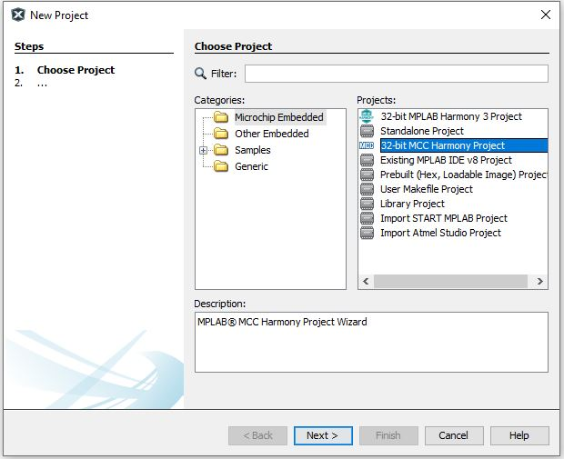

**Step 2: Open MPLAB Code Configurator \(MCC\) . The default project graph will look like the below**

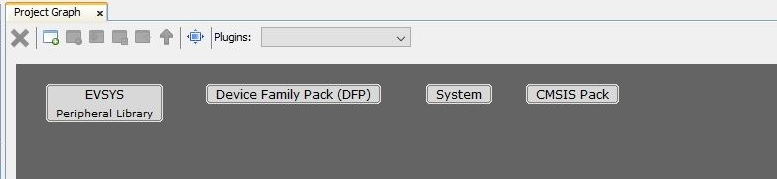

**Step 3: Add the Boot loader component in MCC Project Graph. Accept auto activation and auto connection of components by giving ‘Yes’ to popups. The project graph and configuration options will look like this after adding bootloader component.**

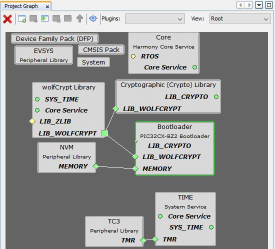

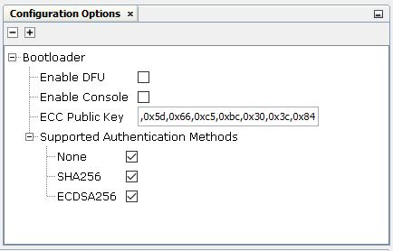

If User can use the default configurations , then SKIP to Step 7 to generate code with the default configuration options.

**Configuration Options in Bootloader**

**Enable DFU option**

By checking/Enabling this option, DFU \(Device Firmware Upgrade\) functionality will be enabled in the bootloader. DFU can be used to upgrade firmware on a target device through serially \(UART\). By Default, this option is disabled. If customer wants to use it, they can enable it.

**Enable Console option**

By checking/Enabling this option, Information on bootloader activities will printed into console using SERCOM UART. By Default, this option is disabled. If customer wants to use it, they can enable it.

**ECC Public Key**

By default, ECC Public key is 0xc2,0x81,0x8f,0xbb,0x28,0x61,0x47,0x8b,0xa2,0x53,0x37,0x79,0xd4,0x63,0x18,0x7c,0x8b,0x41,0x59,0xa9,0x5f,0x0b,0x6b,0x94,0x4e,0xb9,0x57,0xa1,0x03,0xfe,0x20,0xbf,0x2b,0xb8,0x14,0x2a,0x64,0xb5,0xae,0x4a,0x83,0x80,0xdd,0xe6,0xee,0x29,0x89,0xdd,0xa0,0x9a,0xc7,0xda,0x82,0xeb,0x56,0x62,0x90,0x5d,0x66,0xc5,0xbc,0x30,0x3c,0x84

User should be able to change this key by changing the text box.

**Supported Authentication Methods**

Three methods of authentication is supported in the bootloader

-   None
-   SHA-256
-   ECDSA-256

By Default, all these three modes are enabled. If customer want to use a specific authentication alone for security aspect, they can choose that alone and unselect other two’s.

**Step 4: By enabling DFU or Console or both, UART dependency will be enabled.**

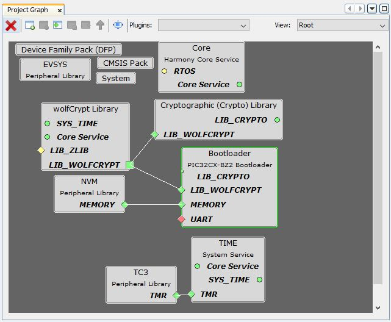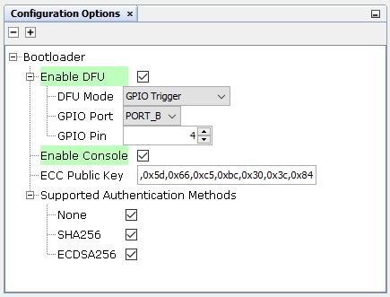

Right click on UART dependency\(Red Diamond in Bootloader Component\) and select SERCOM0 \(for Curiosity board\) to connect the dependency or select different SERCOM based on the board and connect the dependency

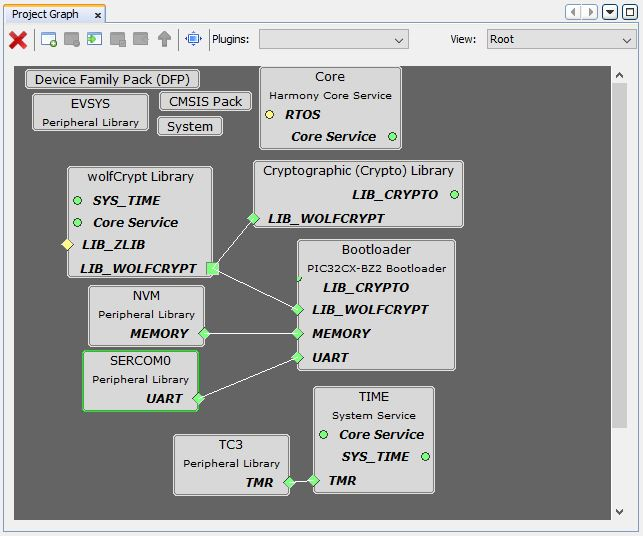

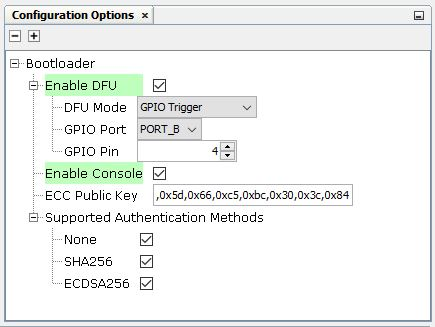

By default, GPIO Trigger DFU Mode is enabled where you need to hold the GPIO button and reset button to put the bootloader into the DFU mode. Use GPIO Port and Pin option to change the port and pin based on the board . Skip to Step 4 with the current configuration. Default Settings are based on the GPIO used in curiosity board

SKIP to Step 7 to generate code with the above configuration changes

**Step 5: Configuration for using Timer based Trigger DFU Mode**

In order to use timer-based trigger DFU Mode where bootloader will be in DFU Mode for the defined amount of time before jumping to the application, select the DFU mode to Timer Based Trigger. Change the DFU wait time if needed. This is the time \(in milliseconds\) where the bootloader will be in DFU mode before jumping to the application. Accept the auto connection of Timer TC0 which is needed for timer operation. The project graph and configuration will look like this after Timer based Trigger DFU mode is selected

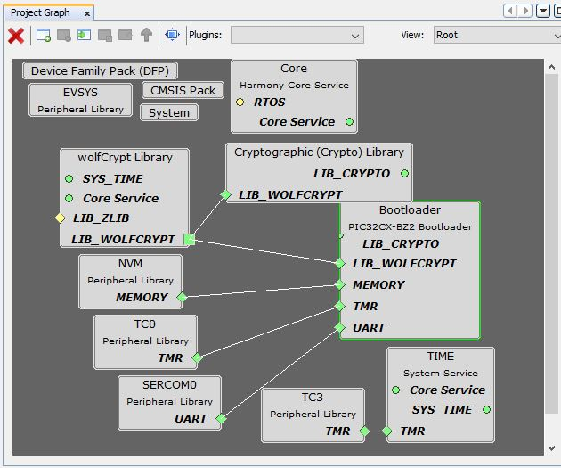

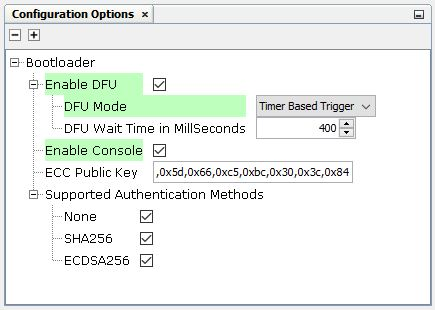

**Step 6: Make sure to modify Receive pinout and Transmit pinout in SERCOM Configuration based on the board**

The below SERCOM0 configuration is for Curiosity board

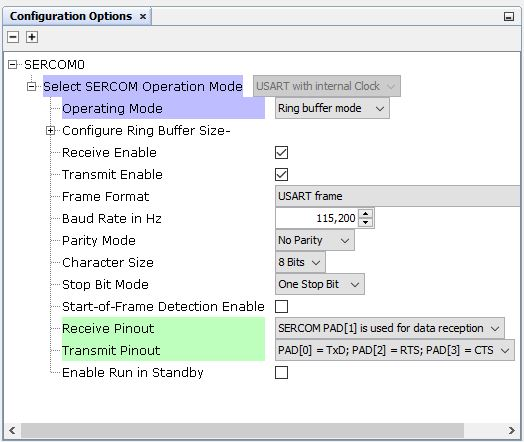

**Step 7: Generate code once the required configuration done**

Go to Resource Management\(MCC\) Tab , then Press ‘Generate’ for generating the code with the selected configuration

**Step 8: Temporary steps to do**

The below temporary steps has to be done in order to bringup a proper working bootloader firmware since these are internal changes yet to be incorporated

-   In the generated project , Find and replace the **crypt\_ecc\_pukcl.c****and****ecc.c** files with the files from wireless\_pic32cxbz\_wbz\\utilities\\pic32cx-bz\\tempBtl
-   In **plib\_clk.c** file, comment the PMD Disable configuration

    //CFG\_REGS-\>CFG\_PMD2 = 0xf3000000;

**Step 9: Build and download the image**

Build the image and download to the target

**Parent topic:**[PIC32CX-BZ2 Standalone Bootloader Component Help](GUID-A04B5B1F-202B-4944-B18F-13E4857CC3CD.md)

