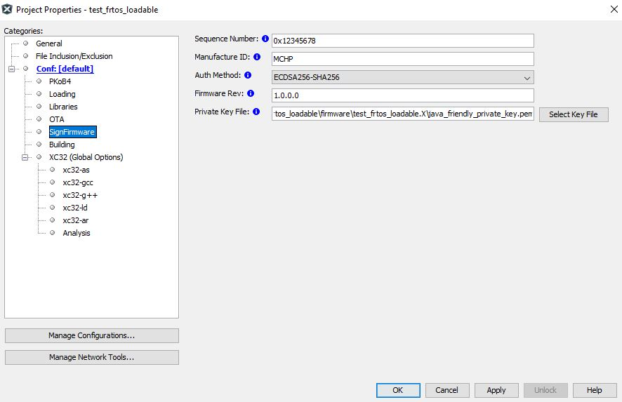
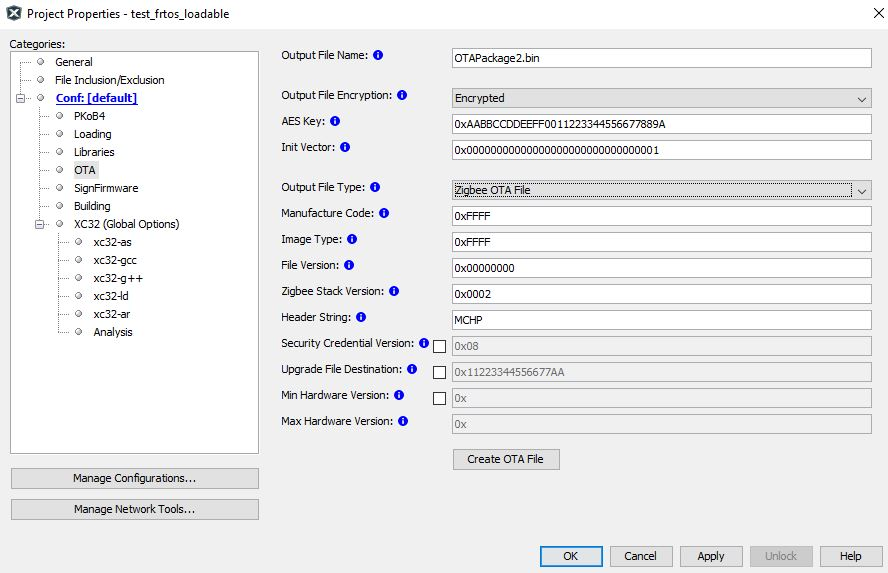

# PIC32CX-BZ2 Bootloader Services Component Help

The PIC32CX-BZ2 Bootloader Services is a utility which helps in creating signed firmware image for OTA with the provided header and OTA header information. Please follow MCC Project Graph and how to add Bootloader services component which is available in Device Resources - Libraries → Harmony → Wireless → Bootloader Services

**Bootloader services utility functional activities with Harmony 3 code generation**

-   Adds the autoload.py script which gets loaded in the project \(See Screenshot\) for getting the required information from user for creating signed Firmware

    

-   Embedding OTA header information as part of the signed firmware binary image.

    

-   Generates linker script with the below memory layout

**Signing**

The complete image including firmware and meta header is signed by the below process

