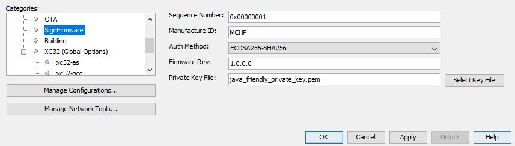
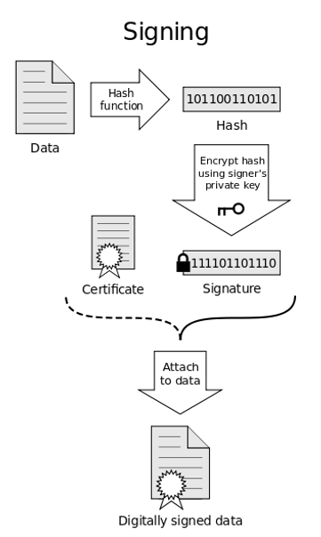
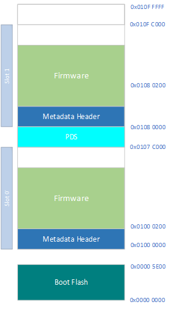

# PIC32CX-BZ2 Bootloader Services Component Help

The PIC32CX-BZ2 Bootloader Services is a utility which helps in creating signed firmware image for OTA with the provided header and OTA header information. Please follow MCC Project Graph and how to add Bootloader services component which is available in Device Resources - Libraries → Harmony → Wireless → Bootloader Services

**Bootloader services utility functional activities with Harmony 3 code generation**

-   Adds the autoload.py script which gets loaded in the project \(See Screenshot\) for getting the required information from user for creating signed Firmware

    

    Please find the description below on the labels.

    |Label Name|Description|
    |----------|-----------|
    |Sequence Number|Sequence Number in 64bit Hex format, range from 0x00000001 to 0xFFFFFFFE|
    |Manufacture ID|Identifier of the Manufacturer. up to 4 ASCII characters|
    |Auth Method|Authentication Method. The supported authentication methods are None, SHA256 and ECDSA256-SHA256|
    |Firmware Revision|Revision of the firmware. It is in the format of x.x.x.x, where x is value in range 0-255|
    |Private Key File|Key used for ECDSA Authentication. It is in PKCS\#8 fromat. This label is enabled only if Auth method is ECDSA256-SHA256|

    The complete image including firmware and meta header is signed by the below process

    

    Bootloader services help in embedding OTA header information as part of the signed firmware binary image which can be done with OTA tab.

    **Output File Type as BLE OTA File**

    

    **Output File Type as Zigbee OTA File**

    

    **Output File Type as Combo OTA File**

    

Please find the below table which includes the description of the label’s/parameter’s used.

|Label Name|Description|
|----------|-----------|
|Output File Name|Output File Name for the OTA package in binary format|
|Output File Encryption|Option to choose whether to Encrypt the OTA package or not. Unencrypted /encrypted|
|AES Key|This option is enabled only if Output File Encryption is set to encrypted. 128bit AES key to encrypt the OTA package with AES-CBC-128|
|Init Vector|This option is enabled only if Output File Encryption is set to encrypted.128bit Initial Vector to encrypt the OTA package with AES-CBC-128|
|Output File Type|Output file types are among BLE, Zigbee or Combo OTA operation|
|Flash Image ID|This option is enabled only if Output File file is set to BLE OTA File or Combo OTA File. It is the 32bit Identification Number for App layer to confirm the new Flash Image is acceptable|
|Manufacture Code|This option is enabled only if Output File file is set to Zigbee OTA File or Combo OTA File. It is the 16-bit manufacturer identifier used to match supported devices. Defaults to 0xFFFF \(match all\)|
|Image Type|This option is enabled only if Output File file is set to Zigbee OTA File or Combo OTA File. It is the 16-bit image type. Defaults to 0xFFFF \(match all\)|
|File Version|This option is enabled only if Output File file is set to Zigbee OTA File or Combo OTA File. It is the 32-bit integer representing the file version. Can be in the recommended format \(8-bit app release, 8-bit app build, 8 bit stack release, 8-bit stack build\), simple increasing version, or an unsupported version format. If in an unsupported version format the OTA Cluster will not be able to compare file versions. Defaults to 0x0000|
|Stack Version|This option is enabled only if Output File file is set to Zigbee OTA File or Combo OTA File. It is the 16-bit identifier of the zigbee stack version. Defaults to 0x02 for zigbee Pro.|
|Header String|This option is enabled only if Output File file is set to Zigbee OTA File or Combo OTA File. It is the 32-byte string used by each manufacturer as they see fit but recommended to be human readable|
|Security Credential Version|This option is enabled only if Output File file is set to Zigbee OTA File or Combo OTA File. It is the optional 8-bit identifier of the Security Credential Version. Defaults to not included|
|Upgrade File Destination|This option is enabled only if Output File file is set to Zigbee OTA File or Combo OTA File. It is the optional 64-bit extended address of the device to which this image is specific. Defaults to not include, image is available to all devices|
|Minimum Hardware Version|This option is enabled only if Output File file is set to Zigbee OTA File or Combo OTA File. It is the optional 0/16-bit integer representing the earliest hardware platform this image can be used on|
|Maximum Hardware Version|This option is enabled only if Output File file is set to Zigbee OTA File or Combo OTA File. It is the optional 16-bit integer representing the latest hardware platform this image can be used on|

Bootloader services generates linker script with the below memory layout which lets the stack to store the image in Slot 1 during stack OTA process.

